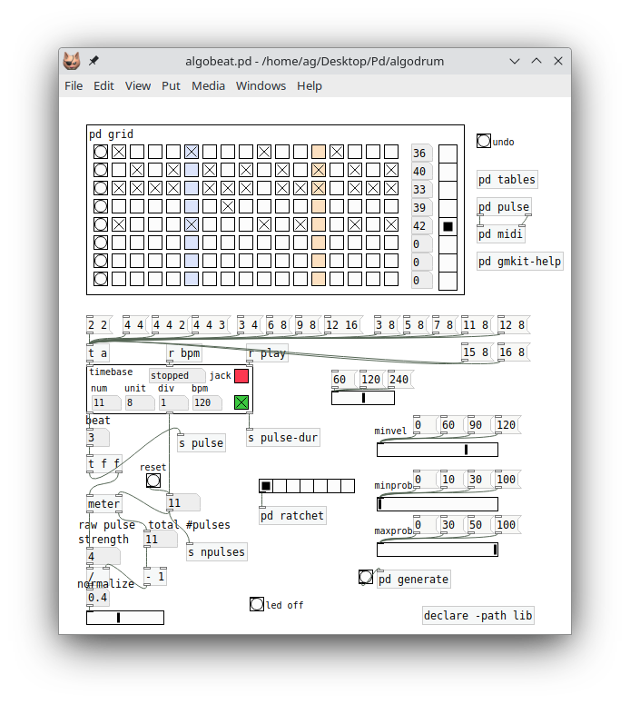

# algodrum

This is an algorithmic drum machine based on Barlow's theory of meter and rhythm as explained in his book "On Musiquantics" (Section 22, "A Quantitative Approach to Metre"). It generates rhythmic patterns for any given meter in an automatic fashion, assigning a unique pulse strength to each pulse. Different notes can be played for different ranges of pulse strengths, and the pulses can be filtered according to their strengths.

algodrum is a bit quirky as drum sequencers go, but it handles complex meters with ease, and can be used to produce interesting and dynamically evolving rhythmic or melodic patterns with a bit of experimentation and creativity. Also, it works more like an arpeggiator and is thus perfectly usable without requiring any real finger drumming skills.

## Prerequisites

algodrum is implemented as a Pd patch, and includes some externals written in Lua, so you'll need Pd (any recent version of vanilla [Pd](http://msp.ucsd.edu/software.html) or [Purr Data](https://agraef.github.io/purr-data/) will do) and Pd-Lua (0.11 or later, available from https://agraef.github.io/pd-lua/; note that Purr Data already includes this and has it in its startup libraries by default).

Tested on Linux and Mac so far, but it's not in any way OS-specific, so it should work fine on Windows, too.

As shipped, algodrum is set up to optionally work with Jack transport, which allows tempo, meter and bbt information to be received from Ardour. This requires a little Jack transport module for Lua (lib/jtime.c) which has to be compiled by running `make` in the lib subdirectory (this needs the Jack development files to be installed). If you don't have Jack or don't care for this feature, you can simply remove the `jacktime` object from the lib/timebase.pd patch to get rid of any corresponding error messages while loading the patch. Note that algodrum can also be driven by an external MIDI clock generator. This feature is still a bit experimental and not quite as convenient, but it may be your only option to synchronize algodrum with your DAW if Jack transport is not available.

## Operation

Normally, playback goes to MIDI channel 10 which usually has a drumkit on a GM-compatible synthesizer. But you can also play melodies by changing the `ch` numbox in the gmkit abstration. In this case you may also want to engage the secondary sample-driven drumkit in the sampler abstraction, which can be used to play along the main sequencer in the gmkit abstraction which outputs MIDI.

Note that at present, due to technical limitations it is not possible to run multiple algodrum instances in a single Pd process. Thus, if you need to run multiple algodrum in concert, you'll have to launch them in different Pd instances. In this case, to keep the multiple instances in sync, you can either start transport using a MIDI controller with transport controls (see "MIDI Controls" below), or by using an external clock source (see "Transport").

### Transport

Playback can be started either through an external clock or using the internal timer. The latter can be invoked by engaging the green toggle in the timebase abstration, or with play/stop controls for the supported MIDI devices (see the MIDI Controls section below for further details). It's also possible to control the patch externally using Jack transport (including BBT information if the server provides it, in which case the meter will be chosen automatically), or using MIDI clocks (in this case you have to choose the meter manually).

To enable Jack transport control, just engage the red `jack` toggle in the timebase abstraction and make sure that your DAW (usually Ardour) is configured as a Jack transport server. For MIDI clocks, engage the `mclk` toggle instead and make sure that the MIDI clocks are delivered to one of Pd's MIDI inputs from the clock-generating device or program that you're using.

### Meter and Tempo

Meter and tempo (bpm) can be changed with the appropriate controls at the top of the patch. These can be changed on the fly at any time. However, note that when using an external timer, the tempo -- and, in the case of Jack transport with Ardour, also the meter -- are dictated by the timer. But it will still be possible to change subdivisions.

Subdivision (the `div` parameter) in the timebase abstraction can be changed to play different kinds of n-tuplets (up to septuplets) based on the current meter. Specifically, duplets and triplets can be activated temporarily with the pitch wheel: up enables duplets, down changes to triplets, and returning the wheel to neutral position changes back to the base meter. For other kinds of n-tuplets, you can change the `div` numbox or include the division as a third number in the meter specification, see the patch for examples. Or you can edit the control abstraction to provide whatever n-tuplets you need in lieu of duplets and triplets.

### Note Input

Notes can be played manually on a connected keyboard or drumpad controller, using a simplistic built-in arpeggiator which distributes the played notes in a round-robin fashion to 16 quantized levels of pulse strengths. The played notes can also be recorded into the pattern with the `rec` button. In `rec` mode you can erase existing notes by engaging the `erase` toggle. Otherwise, `rec` will only replace existing notes with the notes that you are playing, and simply play the already recorded notes otherwise. But once `erase` is turned on in `rec` mode, existing notes will be deleted if there is no note input.

Also note that the 16 pulse strength levels in the note storage only affects the number of different notes the sequencer can play at any one time, but has no bearing on the number of pulses itself. The rhythm can still consist of an arbitrary number of pulses (and different pulse strengths), which is determined by the meter (including the number of subdivisions) only.

Finally, you can create a random pattern with the `rnd` button, or clear the entire pattern with the `clr` button to start from a clean slate. This will overwrite all existing note data on all pulse strength levels. Also, the `def` button resets the pattern, so you can quickly get back to the default state if you messed up. It also resets the MIDI channel and the volume controller in the gmkit abstraction to their default values.

### Pulse Filter

Along with note input, the pulse filter is algodrum's central live performance feature. Two continuous controls can be used to filter by pulse strengths, enabling rhythmic variations and control over which pulse strength levels to both play and record while laying down patterns in an incremental fashion.

To these ends, the green and red sliders in the patch can be adjusted to determine the range of pulse strengths to play and record. The green slider specifies the lower bound, the red slider the upper bound of the range. The two sliders can also be controlled by MIDI controllers (at least on some devices, see "MIDI Controls" below). In this case the slider values can be quantized to the actual pulse strength levels in the current meter for added precision. This is done by engaging the `quantize` toggle above the sliders (which is disabled by default, giving a smoother controller response instead).

The pulse filter can actually be operated in two modes: *filter mode* (the default) and *layering mode* (which is engaged with the `layer` toggle). In both modes, *only* pulses within the given range of pulse strengths can be played and recorded from the current note input. If there is no note input, filtered notes will be played back from the current pattern as usual (unless both `rec` and `erase` are enabled, which will overwrite existing notes with rests if no note input is given).

The modes differ, however, in how filtered-out notes are handled. In *filter mode*, filtered-out notes will not sound at all. By these means, you can mute either low-strength pulses with the green slider (which has the effect of gradually "thinning out" the pulse train as you move the slider), or high-strength pulses with the red slider (giving the rhythm an "off-beat" feel). Of course, you can also do both at the same time. This can be used as a live performance technique, or to edit the sequence while focusing on just a subset of the pulses.

In contrast, *layering* or *overdub mode* will actually play the filtered-out notes from the pattern instead of muting them, but they can neither be overridden by note input nor recorded (or erased). This lets you listen to the entire sequence while modifying (and possibly recording) just the filtered pulses. Again, this can be used as a performance technique, but it also gives you an easy way to edit parts of a pattern in context.

## MIDI Controls

You can hook up a MIDI controller to Pd's MIDI input so that you can input notes and employ the MIDI controls of your device. (Note that algodrum takes input from any MIDI channel, so if you need to filter out some MIDI channels, you'll have to use an external tool for that purpose.) And of course you want to connect Pd's MIDI output to whatever synthesizer you want to play algodrum's output.

NB: You can do without MIDI controller and synthesizer, but then you'll only be able to play presets using the sampled drumkit of the included sampler abstraction. To get the most out of algodrum, you'll really want a suitable MIDI controller (there are many reasonably good budget options available today, such as the [AKAI MPK mini](https://www.akaipro.com/mpk-mini-mk3) keyboards) and either a drumkit sampler or a GM-compatible synth (check, e.g., [Sitala](https://decomposer.de/sitala/) for the former and [Qsynth](https://qsynth.sourceforge.io/) for the latter, which can both be downloaded free of charge).

As already mentioned, all available control schemes accept pitch bends as duplet/triplet controls (see above). In addition, if your MIDI controller has a sustain pedal, you can use it to momentarily engage `rec` mode, which is handy for hands-free operation if you're busy operating the drum pads. Also, the volume control (CC7) can be used to change the MIDI volume in the gmkit abstraction (this can also be operated manually by changing the volume slider with the mouse). Last but not least, presets can be loaded using MIDI program change messages (PC 1 thru 8), see "Managing Presets" below for details.

The available control schemes are provided as abstractions named `control-xyz` in the lib subfolder. At present, we have ready-made control schemes for the AKAI MPK mini and miniplus keyboards, as well as the Donner StarryPad drumpad. There's also a generic control scheme which should work with most MIDI controllers and offers some computer keyboard bindings for functions which might not be readily available as MIDI buttons. Here is a quick rundown of the available control patches:

- control-generic.pd: This assigns CC3 and CC4 to the pulse filter controls, and CC2 to the `layer` toggle. The F1 and F2 keys on the computer keyboard are assigned to the `play` and `rec` functions, respectively.

- control-miniplus.pd: This will work with any of the AKAI MPK mini keyboards. It assigns CC72 and CC73 (a.k.a. K3 and K4) to the pulse filter controls, and CC71 (a.k.a. K2) to the `layer` toggle. On the miniplus, the STOP, PLAY, and REC transport buttons also work as you'd expect.

- control-starrypad.pd: This assigns CC20 and CC21 (a.k.a. F1 and F2) to the pulse filter controls, and CC9 (a.k.a. K2) to the `layer` toggle. The play/stop and rec transport controls are assigned to the appropriate functions. Moreover, since the StarryPad has no pitch bend wheel, the A and B buttons work as momentary switches for duplet/triplet divisions.

- control-combo.pd: This is a combination of the assignments in the generic, miniplus, and starrypad schemes, useful if you have multiple controllers available and want to use them all at the same time.

As I'm lazy and don't want to change the control scheme all the time, control-combo is currently the default. YMMV, so you may want to change it. To use any of these bindings, just replace the control-combo abstraction in the algodrum patch with whatever best suits your purpose. You can also just take the control-combo abstraction and adjust it for your needs. If your controller doesn't match, chances are that you can still get it to work by just changing some CC numbers in the control patch.

If you have any control patches of your own which might be useful for others, please toss them my way so that I can include them in the github project.

## Managing Presets

algodrum includes a simple preset manager, which allows you to store the current settings (meter, division, bpm, MIDI output channel) along with the current pattern as numbered files on permanent storage, which can be recalled at any time. To these ends you'll find a column with eight preset slots on the right-hand side of the main patch. Use the `save` and `load` buttons to save and load individual presets to and from text files in the presets folder. If your MIDI controller allows you to send program change (PC) messages, you can also use these to load presets (PC *n* to switch to preset *n*, where *n* runs from 1 to 8).

Once a preset has been saved, the colors of the buttons change to reflect the status change. There is no button to delete a stored preset, but you can do this outside of Pd by just deleting the corresponding files in the presets folder (preset*n*.*, where *n* denotes the preset number in the range 1-8). (You might want to back up the files in a secure place before you do that.)

# algobeat

In case algodrum is too quirky for your taste, we've also thrown this little step sequencer based on the same theory on rhythm and meter, but using a more traditional 16x8 grid layout. Thus, while algodrum is monophonic, algobeat can play up to 8 notes simultaneously. But the note velocities (and, for the pattern generation feature, the note probabilities) are computed using the same algorithm. algobeat is still a bit experimental and subject to change, but hopefully you should be able to find your way with the preliminary instructions below.

## Usage

MIDI setup is the same as with algodrum, and you can use the same control patches (the control patch can be found in the `pd midi` subpatch in case you want to change it).

As with algodrum, you choose the meter and press play (or enable Jack transport control). In contrast to algodrum, your patterns are stored on the 16x8 grid, meaning that you can have at most 16 steps in each of the 8 lanes. At present, there are no presets, so when launching the patch the grid will come up with the note numbers and toggles from last time you saved the patch.

Subdivisions (the `div` parameter) can be controlled in the same fashion as with algodrum, but they have a different meaning, functioning as a ratchet (repeated notes played as duplets or triplets in the Barlow meter). Also, the `ratchet` control in the main patch actually lets you choose any kind of tuplet that the `meter` object supports (up to septuplets).

### The Grid

On the left-hand-side of the grid, the column with the round buttons lets you commit patterns for playback after toggling the 16 switches in a lane. On the right-hand side, the numbox column lets you enter note numbers to play on each lane, and the radio buttons let you select a lane for entering notes with the MIDI keyboard, and to generate a pattern using the probabilistic functions. All these elements are described in further detail below.

During playback, the current position on the grid is indicated with a light blue bar in the corresponding column. A yellow bar in the grid indicates the range of grid positions to be played, in case the meter has less than 16 beats (the yellow grid column then indicates the first beat that is off the grid).

### Entering Notes

To add a note to a lane, you can either just change the note number on the right, or click the right-hand side radio button on the corresponding row to select the lane and play a note on the MIDI keyboard. Tick all the boxes (toggles) where the note should be triggered. Note that the round button on the left then turns red to indicate that you still need to click the button to commit your changes. Before you do this, the previous version of the pattern continues to play and you still have the opportunity to undo your changes by pressing the `undo` button in the top right corner in the main patch.

Also note that you *must* pick a nonzero note value to have a pattern play on the corresponding lane, i.e., lanes with a zero note value are always excluded from playback.

### Probabilities and Velocities

As an alternative to entering notes manually, you can also choose a range of probabilities with the `minprob` and `maxprob` sliders and push the `generate` button to automatically generate a pattern which reflects the pulse strengths in the current meter. This affects the entire row selected with the radio button on the right-hand side of the grid (up to the number of beats in the current meter), and commits the changes so that the new pattern starts playing immediately. This operation cannot be undone (except by reverting to the last saved version of the patch.)

With the default range of `minprob` and `maxprob` values of 0 and 1, the probability of a note being triggered is determined entirely by the pulse strength computed using Barlow's algorithm, which is interpreted as a probability value in the 0 to 1 range. Thus a low pulse strength means an equally low note probability (with zero strength pulses having zero probability), and a high pulse strength means an equally high note probability (with maximum strength pulses having 100% probability). Increasing the `minprob` value increases all note probabilities (so that even a zero strength pulse has a nonzero probability), while decreasing the `maxprob` value decreases them (so that even a maximum strength pulse might be skipped).

Finally, the `minvel` slider lets you choose a minimum velocity for the playback. As with algodrum, note velocity varies automatically according to pulse strengths. If you lower the `minvel` value, the velocities of lower-strength pulses will be reduced. If you turn it down to 0, the lowest-strength pulses will not sound at all, while cranking the slider all the way up to 1 will make all pulses sound the same (effectively eliminating the Barlow pulse strengths).

Copyright © 2023 by Albert Gräf \<<aggraef@gmail.com>\>. Distributed under the GPL (see COPYING). Please also check my GitHub page at https://agraef.github.io/.
